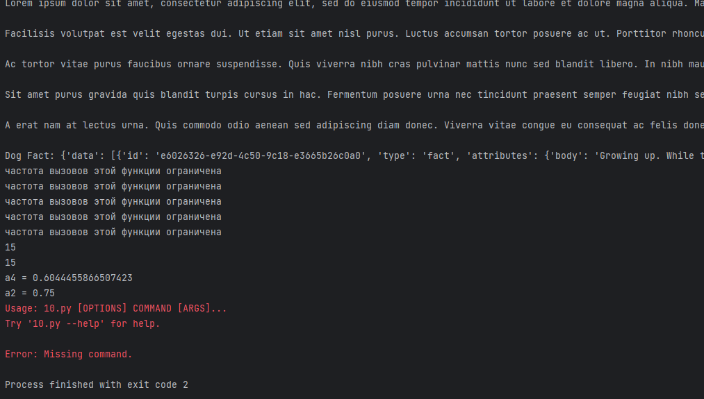

# lab10  

## Задание
    1.Создайте пакет, содержащий 3 модуля на основе лабораторных работ №№ 7-9
    2.Напишите запускающий модуль на основе Typer, который позволит выбирать и настраивать параметры запуска логики из пакета.
    3.Оформите отчёт в README.md. Отчёт должен содержать:
        Условия задач
        Описание проделанной работы
        Скриншоты результатов
        Ссылки на используемые материалы
## Проделанная работа

Создал пакет модулей по предыдущим лабам (7-9)
Затем, на основе Typer написал запускающий модуль, позовляющий выбирать и настраивать параметры запуска логики из пакета модулей.

## Скриншоты

## Список использованных источников

[лаба](https://evil-teacher.on.fleek.co/prog_pm/lab10/)
